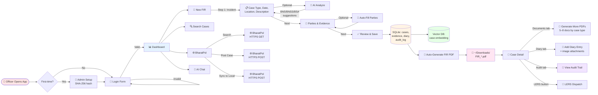
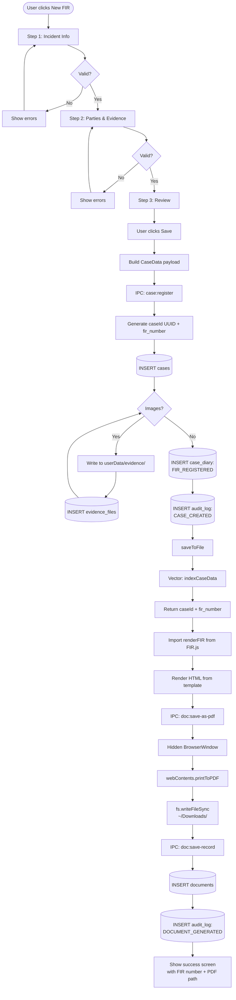
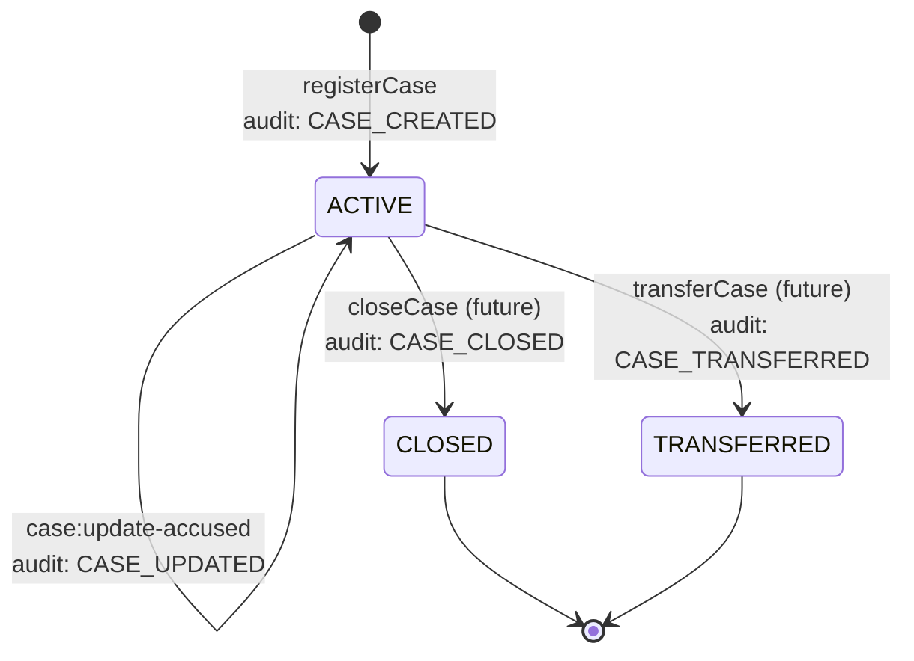
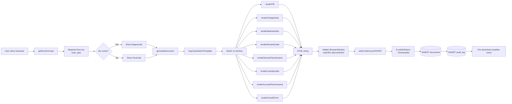

# 🔄 CrimeGPT — Detailed Process Flow Documentation

> **Purpose:** This document is the canonical specification of the **end-to-end business process** of CrimeGPT — from the moment an officer opens the app, through FIR registration, AI-assisted analysis, document generation, diary management, national network sync, and the final audit trail.
>
> It is written as a structured, machine-readable specification so that a **process flow diagram** can be generated from it (manually, via Mermaid / draw.io / Excalidraw, or via an LLM-based diagram agent) without ambiguity.
>
> **Audience:** Hackathon evaluators, government reviewers, system architects, and developers.
>
> **Scope:** 7 stages of the investigative workflow, 40+ decision points, 25+ UI screens, and the full state machine of a case.

---

## 📑 Table of Contents

1. [High-Level Process Overview](#1-high-level-process-overview)
2. [Stage Details](#2-stage-details)
   - [Stage 1: User Login](#stage-1--user-login)
   - [Stage 2: FIR Registration](#stage-2--fir-registration)
   - [Stage 3: AI Section Suggestion](#stage-3--ai-section-suggestion)
   - [Stage 4: Document Generation](#stage-4--document-generation)
   - [Stage 5: Case Diary](#stage-5--case-diary)
   - [Stage 6: BharatPol Sync](#stage-6--bharatpol-sync)
   - [Stage 7: Audit Trail](#stage-7--audit-trail)
3. [State Machine of a Case](#3-state-machine-of-a-case)
4. [Roles & Permissions](#4-roles--permissions)
5. [Event Types Catalog](#5-event-types-catalog)
6. [Document Type Catalog](#6-document-type-catalog)
7. [Error & Edge Case Handling](#7-error--edge-case-handling)
8. [Process Flow Diagram Prompts](#8-process-flow-diagram-prompts)
9. [Mermaid Code (Copy-Paste)](#9-mermaid-code-copy-paste)
10. [ASCII Quick-Reference](#10-ascii-quick-reference)

---

## 1. High-Level Process Overview

The CrimeGPT workflow is a **linear 7-stage pipeline** with **2 major decision branches** and **3 optional parallel sub-flows** (AI analysis, BharatPol sync, LERS dispatch). Every stage produces an **immutable artifact** (DB row, file, or audit log entry) that persists for the lifetime of the case.

### The 7 Stages

```
┌─────────────────────────────────────────────────────────────────────────┐
│                                                                         │
│   ┌──────────┐   ┌──────────┐   ┌──────────┐   ┌──────────┐             │
│   │ Stage 1  │──▶│ Stage 2  │──▶│ Stage 3  │──▶│ Stage 4  │             │
│   │  LOGIN   │   │   FIR    │   │   AI     │   │   DOC    │             │
│   │          │   │   REG    │   │ ANALYSIS │   │   GEN    │             │
│   └──────────┘   └──────────┘   └──────────┘   └──────────┘             │
│                                                       │                 │
│                                                       ▼                 │
│   ┌──────────┐   ┌──────────┐   ┌──────────┐   ┌──────────┐             │
│   │ Stage 7  │◀──│ Stage 6  │◀──│ Stage 5  │◀──│   CASE   │             │
│   │  AUDIT   │   │ BHARATPOL│   │  DIARY   │   │  OPEN    │             │
│   │  TRAIL   │   │  SYNC    │   │          │   │          │             │
│   └──────────┘   └──────────┘   └──────────┘   └──────────┘             │
│                                                                         │
└─────────────────────────────────────────────────────────────────────────┘
```

### Stage Summary

| # | Stage | Trigger | Primary Actor | Output Artifact | Persistence |
|---|---|---|---|---|---|
| 1 | **User Login** | App launch | Officer | Authenticated session | `users` table |
| 2 | **FIR Registration** | Click "New FIR" | IO (Investigating Officer) | `fir_number` (CR-2026-XXXXX) | `cases`, `evidence_files`, `case_diary`, `audit_log` |
| 3 | **AI Section Suggestion** | Click "Analyze Now" | AI (offline Qwen) | BNS/BNSS/BSA section list | `cases.applied_sections` (JSON) |
| 4 | **Document Generation** | Click "Save" or open Case → Documents tab | System (auto) | 5–8 PDF files | `documents` table + `~/Downloads/*.pdf` |
| 5 | **Case Diary** | Open Case → Diary tab → Add Entry | IO | Diary entry with images | `case_diary`, `diary_images` |
| 6 | **BharatPol Sync** | Open BharatPol page or click "Post Case" | Officer | National record linkage | `audit_log` (network call) |
| 7 | **Audit Trail** | Open Case → Audit tab | System (passive) | Timeline view | `audit_log` (read-only) |

### Process Invariants

The following invariants hold at every point in the process:

1. **Every state change is logged.** No action mutates state without an `audit_log` entry.
2. **The case `fir_number` is unique and immutable.** It is generated once and never re-issued.
3. **Documents are append-only.** A new version of a document is a new row in `documents`; the old row is preserved.
4. **AI suggestions are advisory, not authoritative.** Sections suggested by the LLM must be reviewed and approved by the officer before they become `applied_sections`.
5. **All file I/O is sandboxed** to the user's `app.getPath('userData')` directory.
6. **The BharatPol sync is opt-in.** The system never auto-posts a case to the national network.

---

## 2. Stage Details

---

### Stage 1 — User Login

**Goal:** Authenticate the officer, set up the system on first use, and prepare the session.

**UI Screens:** `Login.jsx` (returning users), `Setup.jsx` (first-time admin bootstrap), `AISetup.jsx` (Ollama + model install)

**Actors:** Officer / Administrator

#### 1.1 First-Time Bootstrap (no users exist)

```
┌────────────────────────────────────────────────────────────────────┐
│ START: app.whenReady()                                              │
│   ├─ initDatabase()                                                │
│   ├─ initVectorStore()                                             │
│   ├─ indexAllLegalData()  (2–5 min, one-time)                      │
│   └─ createWindow()  →  renderer mounts                            │
│                                                                      │
│ AuthContext.useEffect: window.crimeGPT.checkSetup()                 │
│   └─ Main: SELECT COUNT(*) FROM users                              │
│   └─ Returns { needsSetup: true }                                  │
│                                                                      │
│ DECISION: needsSetup?                                               │
│   ├─ TRUE  → navigate to /setup                                    │
│   └─ FALSE → navigate to /login                                    │
└────────────────────────────────────────────────────────────────────┘
                              │
                              ▼
┌────────────────────────────────────────────────────────────────────┐
│ SCREEN: Setup.jsx                                                   │
│   ├─ User enters: username, password, confirm password             │
│   ├─ Validation (client-side):                                     │
│   │   ├─ username length ≥ 3                                        │
│   │   ├─ password length ≥ 6                                        │
│   │   ├─ password has ≥ 1 number                                    │
│   │   ├─ password has ≥ 1 uppercase letter                          │
│   │   └─ password === confirm password                              │
│   └─ User clicks "Create Admin Account"                            │
│                                                                      │
│   window.crimeGPT.setupAdmin(username, password)                    │
│   IPC: auth:setup-admin                                             │
│   Main:                                                              │
│     ├─ hasUsers() check  (must be empty)                            │
│     ├─ hash = SHA-256(password)                                     │
│     ├─ INSERT INTO users (username, password_hash, full_name,       │
│     │                     role='ADMIN', badge_number='ADMIN-001')   │
│     └─ saveToFile()                                                 │
│                                                                      │
│   Returns: { success: true }                                        │
│   Renderer: navigate to /login                                      │
└────────────────────────────────────────────────────────────────────┘
```

#### 1.2 Returning User Login

```
┌────────────────────────────────────────────────────────────────────┐
│ SCREEN: Login.jsx                                                   │
│   ├─ Language switcher: EN / हिन्दी / ગુજરાતી                       │
│   ├─ User enters: username, password                                │
│   ├─ Validation: both non-empty                                     │
│   └─ User clicks "Sign In"                                          │
│                                                                      │
│   window.crimeGPT.login(username, password)                         │
│   IPC: auth:login                                                    │
│   Main:                                                              │
│     ├─ SELECT * FROM users WHERE username=? AND is_active=1         │
│     ├─ if no row → { success: false, error: "Invalid credentials" } │
│     ├─ verifyPassword(inputHash, storedHash) — SHA-256 compare      │
│     ├─ if mismatch → { success: false, error: "Invalid credentials" }│
│     └─ if match → { success: true, user: { id, username,            │
│                          fullName, role, badgeNumber } }            │
│                                                                      │
│   Renderer:                                                          │
│     ├─ AuthContext.login() → setUser(result.user)                   │
│     └─ navigate to /dashboard                                       │
│                                                                      │
│ DECISION: login success?                                            │
│   ├─ TRUE  → Stage 1 complete; proceed to Dashboard                │
│   └─ FALSE → show error in red banner; stay on Login                │
└────────────────────────────────────────────────────────────────────┘
```

#### 1.3 AI Setup Wizard (first AI use)

```
┌────────────────────────────────────────────────────────────────────┐
│ TRIGGER: User navigates to any AI feature for the first time        │
│                                                                      │
│ SCREEN: AISetup.jsx                                                 │
│   ├─ Step 1: Detect device                                          │
│   │   ├─ getDeviceSpecs() → { totalRAM, cpuCores, platform }        │
│   │   ├─ getQwenModel() → { name, display, size, reason }          │
│   │   │   ├─ 16GB+ RAM → qwen2.5:7b                                │
│   │   │   ├─ 8GB+  RAM → qwen2.5:3b                                │
│   │   │   └─ <8GB  RAM → qwen2.5:1.5b                              │
│   │   └─ isOllamaInstalled() → { installed, version }              │
│   │                                                                  │
│   ├─ Step 2: Install Ollama (if missing)                            │
│   │   ├─ User clicks "Install Ollama"                               │
│   │   ├─ window.crimeGPT.installOllama()                            │
│   │   ├─ Main: download installer, run silent install                │
│   │   ├─ Stream progress: ai:download-progress { step:'ollama' }    │
│   │   └─ Start ollama serve process                                 │
│   │                                                                  │
│   ├─ Step 3: Pull Qwen LLM                                          │
│   │   ├─ User clicks "Download Model"                               │
│   │   ├─ window.crimeGPT.downloadModel()                            │
│   │   ├─ Main: POST /api/pull { name: qwen2.5:Nb }                  │
│   │   ├─ Stream: ai:download-progress { step:'model', percent }     │
│   │   └─ Done on { status: 'success' }                              │
│   │                                                                  │
│   ├─ Step 4: Pull nomic-embed-text (for RAG)                        │
│   │   ├─ User clicks "Download Embedding Model"                     │
│   │   ├─ window.crimeGPT.downloadEmbedModel()                       │
│   │   └─ Same flow as Step 3                                        │
│   │                                                                  │
│   └─ Done: show green checkmark; "AI is ready"                      │
└────────────────────────────────────────────────────────────────────┘
```

**Exit condition:** Authenticated user with `user` object in AuthContext, optionally with Ollama running and models pulled.

**State written:**
- `users` table: 1 new row (first-run only)

---

### Stage 2 — FIR Registration

**Goal:** Capture a single canonical record of the incident with all required parties, evidence, and metadata. The system then auto-generates the FIR PDF and creates a `fir_number` that becomes the case's permanent identifier.

**UI Screen:** `NewCase.jsx` (3-step wizard)

**Actor:** IO (Investigating Officer)

#### 2.1 Step 1 — Incident Information

```
┌────────────────────────────────────────────────────────────────────┐
│ SCREEN: NewCase.jsx, step 1                                         │
│   Form fields:                                                       │
│     • Case Type  (dropdown: Theft, Murder, Assault, Robbery,        │
│                   Fraud, Kidnapping, Domestic Violence,             │
│                   Cyber Crime, Rape, Dowry, Other)                  │
│     • Language   (toggle: English | हिन्दी | ગુજરાતી)               │
│     • Incident Date  (date picker, required)                        │
│     • Incident Time  (time picker, optional)                        │
│     • Incident Location  (free text, required)                      │
│     • Description  (textarea, required, min 20 chars)               │
│                                                                      │
│   Optional AI actions:                                               │
│     • [✨ Analyze Now]    → Stage 3 (AI Section Suggestion)          │
│     • [🤖 AI Auto-Fill]   → AI extracts case fields from desc       │
│                                                                      │
│   User clicks "Parties & Evidence" → next()                        │
│   Validation:                                                        │
│     ├─ caseType required                                            │
│     ├─ incidentDate required                                        │
│     ├─ incidentLocation required                                    │
│     └─ description.trim().length ≥ 20                              │
│                                                                      │
│ DECISION: valid?                                                    │
│   ├─ FALSE → show red error under each invalid field               │
│   └─ TRUE  → setStep(2)                                             │
└────────────────────────────────────────────────────────────────────┘
```

#### 2.2 Step 2 — Parties & Evidence

```
┌────────────────────────────────────────────────────────────────────┐
│ SCREEN: NewCase.jsx, step 2                                         │
│   Section A: Complainant Details                                    │
│     • Full Name (required), Phone, Address                           │
│     • ID Type (Aadhaar | Voter ID | Passport | Driving License)     │
│     • ID Number                                                      │
│                                                                      │
│   Section B: Accused Details                                        │
│     • Full Name, Alias, Father's Name, Age                           │
│     • Physical Description (textarea)                                │
│                                                                      │
│   Section C: Witness Details                                        │
│     • Name, Phone, Statement                                        │
│                                                                      │
│   Section D: Seized Items                                           │
│     • Repeatable rows: item, qty, seized_from                        │
│     • [+ Add Item] / [🗑] buttons                                  │
│                                                                      │
│   Section E: Evidence Photos                                        │
│     • File input: accept image/*                                    │
│     • Each file: max 10MB                                           │
│     • Thumbnails displayed; [X] to remove                            │
│     • Stored in component state as File objects                     │
│                                                                      │
│   Optional AI action:                                                │
│     • [🤖 Auto-Fill All Parties] → AI extracts names from desc     │
│                                                                      │
│   User clicks "Review & Save" → next()                              │
│   Validation: complainantName required                              │
│                                                                      │
│ DECISION: valid?                                                    │
│   ├─ FALSE → show error                                             │
│   └─ TRUE  → setStep(3)                                             │
└────────────────────────────────────────────────────────────────────┘
```

#### 2.3 Step 3 — Review & Save

```
┌────────────────────────────────────────────────────────────────────┐
│ SCREEN: NewCase.jsx, step 3                                         │
│   Read-only summary table:                                           │
│     • Case Type                                                      │
│     • Date & Time                                                    │
│     • Location                                                       │
│     • Complainant                                                    │
│     • Accused                                                        │
│     • AI Suggested Sections (if any)                                 │
│     • Description (full text)                                       │
│                                                                      │
│   Document generation notice:                                        │
│     "First Information Report (FIR) — Auto-generated on save"        │
│                                                                      │
│   User clicks "Save Case & Generate FIR"                             │
└────────────────────────────────────────────────────────────────────┘
                              │
                              ▼
┌────────────────────────────────────────────────────────────────────┐
│ ACTION: handleSave()                                                │
│   1. Convert evidenceFiles to base64 via FileReader                 │
│   2. Parse AI-suggested sections from aiSections.summary             │
│      Regex: /(BNS|BNSS|BSA)\s+Section\s+(\d+)\s*[-–]\s*(.+)/        │
│      → push { law, section, title, confidence: 90, reasoning }      │
│   3. Build CaseData payload                                         │
│   4. window.crimeGPT.registerCase(caseData)                          │
│      IPC: case:register                                              │
└────────────────────────────────────────────────────────────────────┘
                              │
                              ▼
┌────────────────────────────────────────────────────────────────────┐
│ MAIN PROCESS: registerCase() in case-manager.js                    │
│   ├─ Generate caseId = uuidv4()                                     │
│   ├─ firNumber = caseData.fir_number || generateFIRNumber()         │
│   │            = "CR-2026-XXXXX"                                     │
│   ├─ Stringify JSON columns: complainant, accused, witnesses,        │
│   │                           seized_items, sections                │
│   ├─ INSERT INTO cases (...) — see schema in data_flow.md §6.A      │
│   │                                                                  │
│   ├─ For each evidence image:                                       │
│   │   ├─ Write file to userData/evidence/{caseId}/{uuid}.{ext}     │
│   │   └─ INSERT INTO evidence_files                                 │
│   │                                                                  │
│   ├─ INSERT INTO case_diary                                         │
│   │   event_type = 'FIR_REGISTERED'                                 │
│   │   title = 'FIR Registered'                                       │
│   │   description = "FIR <num> registered for <type> at <loc>"      │
│   │                                                                  │
│   ├─ logAudit(caseId, 'CASE_CREATED',                               │
│   │            "FIR <num> registered for <type>", officerName)       │
│   │                                                                  │
│   ├─ saveToFile() — serialize sql.js to crimegpt.db                  │
│   │                                                                  │
│   └─ indexCaseData(caseData) — embed + push to vector store         │
│                                                                      │
│   Returns: { success: true, caseId, fir_number }                    │
└────────────────────────────────────────────────────────────────────┘
                              │
                              ▼
┌────────────────────────────────────────────────────────────────────┐
│ ACTION: Auto-generate FIR PDF (inline after save)                   │
│   1. const { renderFIR } = await import('electron/doc/FIR.js')       │
│   2. html = renderFIR({ fir_number, fields, parties, sections, ... })│
│   3. window.crimeGPT.saveAsPDF(html, `FIR_${fir_number}.pdf`)        │
│      IPC: doc:save-as-pdf                                            │
│      Main:                                                           │
│        ├─ Hidden BrowserWindow.loadURL('data:text/html;...')         │
│        ├─ webContents.printToPDF({ printBackground: true })         │
│        ├─ fs.writeFileSync(downloads/<filename>, pdfBuffer)         │
│        └─ Fire 'download-complete' event to renderer                │
│   4. window.crimeGPT.saveDocRecord(caseId, 'FIR',                    │
│            'First Information Report', pdfPath)                      │
│      IPC: doc:save-record                                            │
│      Main: INSERT INTO documents (..., doc_format='pdf')             │
│   5. logAudit('DOCUMENT_GENERATED', 'First Information Report')     │
│                                                                      │
│ Returns: success screen with FIR number + PDF path                  │
└────────────────────────────────────────────────────────────────────┘
```

**Exit condition:** Case row exists in DB; FIR PDF saved; user lands on success screen.

**State written:**
- `cases` table: 1 new row
- `evidence_files` table: 0–N rows
- `case_diary` table: 1 new row (FIR_REGISTERED)
- `audit_log` table: 2 new rows (CASE_CREATED + DOCUMENT_GENERATED)
- `documents` table: 1 new row (FIR)
- Vector store: 1 new entry in `cases.json`
- Filesystem: 0–N evidence images + 1 PDF

---

### Stage 3 — AI Section Suggestion

**Goal:** Given the free-text incident description, suggest the most applicable BNS, BNSS, and BSA sections with reasoning. The output is **advisory** — the officer reviews and approves.

**UI Screen:** Inline panel in `NewCase.jsx` step 1, also available via `AIChat.jsx`.

**Actors:** Officer (trigger), AI (offline Qwen 2.5 + RAG over BNS/BNSS/BSA corpus)

#### 3.1 Fast JSON Path (used in NewCase wizard)

```
┌────────────────────────────────────────────────────────────────────┐
│ TRIGGER: User clicks [✨ Analyze Now] in NewCase step 1            │
│                                                                      │
│ React: analyzeWithAI()                                              │
│   ├─ Validate description is non-empty                              │
│   └─ window.crimeGPT.suggestSections(description)                   │
│      IPC: ai:suggest-sections                                        │
│      Main: vector-db.js → suggestSections(query)                    │
│                                                                      │
│  ┌──────────────────────────────────────────────────────────────┐  │
│  │ STAGE 1 of pipeline — Query Rewriting                        │  │
│  │   askOllama(SEARCH_QUERY_PROMPT.replace('{{QUERY}}', desc))  │  │
│  │   → rewrittenQuery like "theft night dwelling bns"           │  │
│  │   Fallback: original description if LLM call fails           │  │
│  └──────────────────────────────────────────────────────────────┘  │
│                              │                                       │
│                              ▼                                       │
│  ┌──────────────────────────────────────────────────────────────┐  │
│  │ STAGE 2 of pipeline — Vector Retrieval                      │  │
│  │   results = await searchLaws(rewrittenQuery, 5)              │  │
│  │   if empty → searchLaws(originalDescription, 5)             │  │
│  │   Each result: { law, section, title, coreContent,           │  │
│  │                  procedure, illustration, score }             │  │
│  └──────────────────────────────────────────────────────────────┘  │
│                              │                                       │
│                              ▼                                       │
│  ┌──────────────────────────────────────────────────────────────┐  │
│  │ STAGE 3 of pipeline — Format Answer (Qwen)                   │  │
│  │   context = results.map(r =>                                 │  │
│  │     "BNS Section 303 - Theft\n..."                           │  │
│  │   ).join('\n')                                                │  │
│  │   answer = askOllama(                                        │  │
│  │     SECTION_SUGGESTION_PROMPT.replace('{{CONTEXT}}', ctx)   │  │
│  │   )                                                            │  │
│  │   Returns formatted list:                                    │  │
│  │     "BNS Section 303 - Theft                                  │  │
│  │      BNS Section 331 - House Trespass                         │  │
│  │      BNSS Section 173 - FIR Registration"                     │  │
│  └──────────────────────────────────────────────────────────────┘  │
│                              │                                       │
│                              ▼                                       │
│ Returns to renderer: string answer                                   │
│ Renderer: render in <pre> block in orange/green gradient panel       │
│                                                                      │
│ DECISION: officer happy?                                            │
│   ├─ YES → sections are saved to caseData.sections on save          │
│   └─ NO  → officer can edit/ignore; AI panel remains visible        │
└────────────────────────────────────────────────────────────────────┘
```

#### 3.2 RAG Path (used in AIChat for complex questions)

See `data_flow.md` §5.4 for the full 3-stage RAG pipeline. Outputs a **synthesized legal opinion** with section citations and similar past cases — used for open-ended questions like "how do I handle a dowry death FIR?".

**Exit condition:** AI suggestions displayed in the UI; officer decides to apply, modify, or ignore.

**State written:** None directly. Sections are persisted only when the case is saved (Stage 2.3).

---

### Stage 4 — Document Generation

**Goal:** Auto-generate all legally required documents (5–8 PDFs) for the case based on its `case_type`. Documents are formatted per BPR&D standards and saved to the officer's Downloads folder.

**UI Screen:** `CaseDetail.jsx` → Documents tab

**Actor:** System (auto), IO (trigger)

#### 4.1 Document Catalog Selection

```
┌────────────────────────────────────────────────────────────────────┐
│ TRIGGER: User opens Case Detail → Documents tab                     │
│                                                                      │
│ React: getDocsForCase(caseId)                                       │
│   IPC: doc:get-for-case                                              │
│   Main: getDocumentsForCase(caseId)                                  │
│     ├─ SELECT case_type FROM cases WHERE id = ?                     │
│     ├─ required = getRequiredDocuments(case_type)                    │
│     │   Switch on case_type → 5–8 doc keys                          │
│     ├─ generated = getGeneratedDocuments(caseId)                    │
│     │   SELECT * FROM documents WHERE case_id = ?                    │
│     └─ Merge: for each required doc, mark generated/path/date       │
│                                                                      │
│ Returns: [{ key, name, required, generated, path, date }, ...]      │
│ Renderer: render document list with status badges                   │
└────────────────────────────────────────────────────────────────────┘
```

**Document type matrix** (from `document-manager.js` `DOCUMENT_RULES`):

| Case Type | FIR | Charge Sheet | Remand | Medical | Seizure | Custody | Panchnama | Face ID |
|---|:-:|:-:|:-:|:-:|:-:|:-:|:-:|:-:|
| **Theft** | ✓ | ✓ |   |   | ✓ |   | ✓ | ✓ |
| **Murder** | ✓ | ✓ | ✓ | ✓ | ✓ | ✓ | ✓ | ✓ |
| **Assault** | ✓ | ✓ |   | ✓ |   |   | ✓ | ✓ |
| **Robbery** | ✓ | ✓ | ✓ |   | ✓ | ✓ | ✓ | ✓ |
| **Rape** | ✓ | ✓ | ✓ | ✓ |   | ✓ | ✓ | ✓ |
| **Fraud** | ✓ | ✓ |   |   | ✓ |   | ✓ |   |
| **Kidnapping** | ✓ | ✓ | ✓ |   |   | ✓ | ✓ | ✓ |
| **Domestic Violence** | ✓ | ✓ |   | ✓ |   |   | ✓ |   |
| **Cyber Crime** | ✓ | ✓ |   |   | ✓ |   | ✓ |   |
| **Dowry** | ✓ | ✓ | ✓ | ✓ |   |   | ✓ |   |
| **Other** | ✓ | ✓ |   |   |   |   | ✓ | ✓ |

#### 4.2 Per-Document Generation Flow

```
┌────────────────────────────────────────────────────────────────────┐
│ TRIGGER: User clicks "Generate" on a single document               │
│                                                                      │
│ React: generateDocument(caseId, docKey, caseData)                   │
│   IPC: doc:generate                                                  │
│   Main: generateDocumentForCase(caseId, docKey, caseData)            │
│                                                                      │
│  ┌──────────────────────────────────────────────────────────────┐  │
│  │ Step A: Map caseData → templateData                          │  │
│  │   mapCaseDataToTemplate() normalizes all JSON fields          │  │
│  │   into the nested structure expected by renderers:            │  │
│  │     fir{}, complainant{}, accused[], panchnama{},             │  │
│  │     court{}, hospital{}, victim{}, physical{}, seal{},        │  │
│  │     muddamal{}, property{}, certification{}, etc.             │  │
│  └──────────────────────────────────────────────────────────────┘  │
│                              │                                       │
│                              ▼                                       │
│  ┌──────────────────────────────────────────────────────────────┐  │
│  │ Step B: Dispatch to doc-specific renderer                    │  │
│  │   switch (docKey):                                            │  │
│  │     case 'FIR':             renderFIR(templateData)          │  │
│  │     case 'CHARGESHEET':     renderChargesheet(templateData)  │  │
│  │     case 'MEDICAL_LETTER':  renderMedicalLetter(templateData)│  │
│  │     case 'REMAND_LETTER':   renderRemandLetter(              │  │
│  │                                 singleAccusedData)          │  │
│  │     case 'SEIZURE_RECEIPT': renderSeizurePanchanama(         │  │
│  │                                 templateData)                │  │
│  │     case 'COURT_CUSTODY':   renderCustodyLetter(             │  │
│  │                                 singleAccusedData)          │  │
│  │     case 'PANCHNAMA':       renderAccusedPanchanama(         │  │
│  │                                 singleAccusedData)          │  │
│  │     case 'FACE_ID':         renderFaceIDForm({               │  │
│  │                                 ...singleAccusedData,        │  │
│  │                                 photo_path: caseData._accusedPhoto })  │
│  │   Each renderer = pure JS function returning HTML string     │  │
│  └──────────────────────────────────────────────────────────────┘  │
│                              │                                       │
│                              ▼                                       │
│  ┌──────────────────────────────────────────────────────────────┐  │
│  │ Step C: HTML → PDF (headless Chromium)                       │  │
│  │   filename = "${docName}_${fir_number}.pdf"                  │  │
│  │   generateAndSavePDF(html, filename)                         │  │
│  │     ├─ Hidden BrowserWindow.loadURL('data:text/html;...')    │  │
│  │     ├─ webContents.printToPDF({ printBackground: true })     │  │
│  │     └─ fs.writeFileSync(downloads/<filename>, pdfBuffer)     │  │
│  └──────────────────────────────────────────────────────────────┘  │
│                              │                                       │
│                              ▼                                       │
│  ┌──────────────────────────────────────────────────────────────┐  │
│  │ Step D: Persist + Audit                                      │  │
│  │   saveDocumentRecord(caseId, docKey, docName, pdfPath)       │  │
│  │   logAudit(caseId, 'DOCUMENT_GENERATED', docName, officer)   │  │
│  │   saveToFile()                                                │  │
│  └──────────────────────────────────────────────────────────────┘  │
│                                                                      │
│ Returns: { success: true, path }                                    │
│ Renderer: show success toast; update document list                  │
└────────────────────────────────────────────────────────────────────┘
```

#### 4.3 Special Case: Face Identification Form

```
┌────────────────────────────────────────────────────────────────────┐
│ TRIGGER: User clicks "Generate" on Face ID document                  │
│   AND accused photo is not in evidence                              │
│                                                                      │
│ React (CaseDetail.jsx):                                              │
│   1. setShowFaceIDModal(true) — open camera capture modal            │
│   2. User grants camera access via getUserMedia                      │
│   3. User positions accused, clicks "Capture"                        │
│   4. Canvas snapshot → base64 → setAccusedPhoto(base64)             │
│   5. User fills faceIDForm (height, build, complexion, marks, etc.) │
│   6. User clicks "Generate Face ID Form"                             │
│   7. updateCaseAccused(caseId, [{...accusedFields, photo: base64}]) │
│      IPC: case:update-accused                                        │
│   8. window.crimeGPT.generateDocument(caseId, 'FACE_ID', caseData)   │
│      → renderer receives caseData._accusedPhoto → embeds in PDF    │
└────────────────────────────────────────────────────────────────────┘
```

**Exit condition:** All required documents have `generated: true` in the document list; PDFs exist in `~/Downloads/`.

**State written per document:**
- `documents` table: 1 new row
- `audit_log` table: 1 new row (DOCUMENT_GENERATED)
- Filesystem: 1 new PDF

---

### Stage 5 — Case Diary

**Goal:** Maintain a chronological, append-only log of all investigative events for the case, with optional image evidence per entry.

**UI Screen:** `CaseDetail.jsx` → Diary tab

**Actor:** IO (Investigating Officer)

#### 5.1 Diary Entry Creation

```
┌────────────────────────────────────────────────────────────────────┐
│ TRIGGER: User opens Case Detail → Diary tab → [+ Add Entry]         │
│                                                                      │
│ React: showDiaryForm = true; form opens inline                      │
│   Form fields:                                                       │
│     • Event Type  (dropdown — see Event Types Catalog §5)           │
│     • Title (required)                                               │
│     • Description (textarea)                                         │
│     • Date (date picker, default = today)                            │
│     • Time (time picker, default = now)                              │
│     • Location (free text)                                           │
│     • Image attachments (file input, multiple)                       │
│                                                                      │
│ User clicks "Save Entry"                                            │
│   React: addDiaryEntry(formData + case_id + images as base64)        │
│   IPC: diary:add                                                      │
│   Main: addDiaryEntry(caseId, entryData) in case-manager.js          │
│                                                                      │
│  ┌──────────────────────────────────────────────────────────────┐  │
│  │ Main:                                                        │  │
│  │   1. logAudit(caseId, 'DIARY_ENTRY', title, officer)  ← FIRST│  │
│  │   2. INSERT INTO case_diary (id, case_id, entry_date,        │  │
│  │        entry_time, event_type, title, description,            │  │
│  │        location, officer_name)                               │  │
│  │   3. For each image:                                         │  │
│  │      ├─ fs.writeFileSync(                                    │  │
│  │      │     userData/diary_images/{caseId}/{entryId}/{uuid}.{ext},  │  │
│  │      │     Buffer.from(base64, 'base64'))                    │  │
│  │      └─ INSERT INTO diary_images (id, diary_entry_id,        │  │
│  │             file_path, file_name, file_size)                  │  │
│  │   4. saveToFile()                                            │  │
│  │   5. indexCaseData({                                         │  │
│  │        id: entryId, fir_number, description,                 │  │
│  │        incident_date, case_type: 'DIARY_ENTRY',              │  │
│  │        sections_applied: []                                  │  │
│  │      })                                                       │  │
│  │      → getEmbedding → push to casesStore → write cases.json │  │
│  │                                                                  │  │
│  │ Returns: { success: true, entryId }                          │  │
│  └──────────────────────────────────────────────────────────────┘  │
│                                                                      │
│ Renderer: refresh diary list; show success notification              │
└────────────────────────────────────────────────────────────────────┘
```

#### 5.2 Diary Read

```
┌────────────────────────────────────────────────────────────────────┐
│ TRIGGER: User opens Case Detail → Diary tab                         │
│                                                                      │
│ React: getCaseDiary(caseId)                                          │
│   IPC: diary:get                                                      │
│   Main: SELECT * FROM case_diary WHERE case_id = ?                  │
│         ORDER BY entry_date DESC, entry_time DESC                    │
│   (images are joined in getFullCase separately)                      │
│   Returns: DiaryEntry[]                                              │
│                                                                      │
│ Renderer: render timeline view                                       │
│   • Newest entries first                                             │
│   • Color-coded by event_type                                        │
│   • Show event type label, date, time, title, description, images   │
│   • Image thumbnails (clickable to enlarge)                          │
└────────────────────────────────────────────────────────────────────┘
```

**State written per diary entry:**
- `case_diary` table: 1 new row
- `diary_images` table: 0–N rows
- `audit_log` table: 1 new row (DIARY_ENTRY)
- Filesystem: 0–N image files
- Vector store: 1 new entry (case_type: 'DIARY_ENTRY')

---

### Stage 6 — BharatPol Sync

**Goal:** Enable inter-state police coordination by searching the national criminal database, syncing remote cases, and posting local cases to the national network.

**UI Screen:** `BharatPol.jsx` (dedicated page accessible from sidebar)

**Actor:** Officer (explicit user actions only — no auto-sync)

#### 6.1 Criminal Lookup (read from BharatPol)

```
┌────────────────────────────────────────────────────────────────────┐
│ TRIGGER: User clicks "BharatPol" in sidebar                          │
│                                                                      │
│ React: fetchCriminals({ page: 1, limit: 5 })                         │
│   IPC: bharatpol:get-criminals                                       │
│   Main:                                                               │
│     ├─ query = URLSearchParams({ page, limit }).toString()           │
│     ├─ url = `${BHARATPOL_API}/api/criminals?${query}`               │
│     ├─ httpGet(url) via electron.net.request                        │
│     └─ Returns: { success, data[], total, totalPages }              │
│                                                                      │
│ Renderer: render paginated list of criminals                         │
│   Each criminal:                                                     │
│     • Name, Father Name, Phone, Last Known Location                  │
│     • Danger Level badge: HIGH (red) | MEDIUM (orange) | LOW (green)│
│     • WANTED badge (red) if isWanted = true                          │
│     • Expandable: Previous Cases list                                │
│                                                                      │
│ User types in search → re-fetch with { search: 'query' } param      │
└────────────────────────────────────────────────────────────────────┘
```

#### 6.2 Pull Case (Sync from BharatPol to local)

```
┌────────────────────────────────────────────────────────────────────┐
│ TRIGGER: User clicks [Sync to Local] on a criminal's previous case │
│                                                                      │
│ React: handleSyncCase(criminal, caseData)                            │
│   payload = {                                                         │
│     firNumber: caseData.firNumber,                                  │
│     accusedName: criminal.name,                                      │
│     accusedPhone: criminal.phone                                     │
│   }                                                                   │
│   window.crimeGPT.syncBharatPolCase(payload)                         │
│   IPC: bharatpol:sync-case                                           │
│   Main:                                                               │
│     ├─ httpPost(`${BHARATPOL_API}/api/cases/sync`, payload)          │
│     └─ Returns: { success: true }                                   │
│                                                                      │
│ Renderer: show success toast                                         │
│                                                                      │
│ NOTE: For the prototype, the synced case is logged in the UI but     │
│ not auto-inserted into the local SQLite. A production version would: │
│   • INSERT INTO cases with the remote data                            │
│   • Add a 'SYNCED_FROM_BHARATPOL' diary entry                         │
│   • Log audit (CASE_SYNCED)                                          │
└────────────────────────────────────────────────────────────────────┘
```

#### 6.3 Push Case (Share from local to BharatPol)

```
┌────────────────────────────────────────────────────────────────────┐
│ TRIGGER: User clicks [Post Case to BharatPol] in top bar             │
│                                                                      │
│ React: opens modal listing all local cases                           │
│   User selects a case, clicks [Post]                                  │
│                                                                      │
│ React: handlePostCase(caseData)                                      │
│   Build payload from local SQLite row:                                │
│     payload = {                                                       │
│       firNumber, caseType, description, incidentDate,                │
│       incidentLocation, officerName,                                 │
│       station: 'CrimeGPT Police Station, Ahmedabad',                 │
│       sections: parsed from applied_sections JSON,                   │
│       accusedName: caseData.accused[0]?.full_name,                   │
│       accusedPhone: caseData.accused[0]?.phone                       │
│     }                                                                 │
│   window.crimeGPT.shareBharatPolCase(payload)                         │
│   IPC: bharatpol:share-case                                          │
│   Main:                                                               │
│     ├─ console.log('[BharatPol] Sharing case:', payload.firNumber)  │
│     ├─ httpPost(`${BHARATPOL_API}/api/cases/share`, payload)         │
│     └─ Returns: { success: true }                                   │
│                                                                      │
│ Renderer:                                                             │
│   ├─ Mark case as posted (add to postedCases Set)                    │
│   ├─ Show green BadgeCheck icon next to fir_number                   │
│   └─ Show success toast: "Case Posted — <fir> shared to BharatPol"  │
│                                                                      │
│ NOTE: No local audit log entry is written for the post action.       │
│ A production version would add a 'BHARATPOL_POSTED' diary entry.     │
└────────────────────────────────────────────────────────────────────┘
```

#### 6.4 LERS Dispatch (Lawful Electronic Request)

```
┌────────────────────────────────────────────────────────────────────┐
│ TRIGGER: User in CaseDetail → clicks [📨 Send LERS Request]         │
│                                                                      │
│ React: User fills:                                                    │
│   • Platform: WhatsApp | Meta | Google | Telegram                     │
│   • Target Identifier: phone, email, or username                     │
│   window.crimeGPT.sendLERS({ caseId, platform, targetIdentifier })   │
│   IPC: lers:send                                                      │
│   Main:                                                               │
│     ├─ id = uuidv4()                                                  │
│     ├─ INSERT INTO lers_requests (id, case_id, platform,              │
│     │       target_identifier, status='SENT', request_data)           │
│     ├─ saveToFile()                                                   │
│     └─ Returns: { success, requestId, status: 'SENT', message }       │
│                                                                      │
│ Renderer: show toast confirmation                                    │
│ NOTE: This is a mock — no actual HTTP call to the platform.          │
└────────────────────────────────────────────────────────────────────┘
```

**State written:**
- LERS: 1 row in `lers_requests`
- BharatPol share: 0 rows locally (network call only)
- BharatPol sync: 0 rows locally (network call only — production would INSERT a case)

---

### Stage 7 — Audit Trail

**Goal:** Provide an immutable, chronological view of every action taken on a case for accountability and forensic review.

**UI Screen:** `CaseDetail.jsx` → Audit tab (renders `AuditTrail.jsx`)

**Actor:** System (passive — automatic on every action)

#### 7.1 Read Flow

```
┌────────────────────────────────────────────────────────────────────┐
│ TRIGGER: User opens Case Detail → Audit tab                          │
│                                                                      │
│ React (AuditTrail.jsx):                                               │
│   useEffect → window.crimeGPT.getAuditLog(caseId)                    │
│   IPC: audit:get-for-case                                            │
│   Main:                                                               │
│     ├─ SELECT * FROM audit_log WHERE case_id = ?                     │
│     │     ORDER BY created_at DESC                                   │
│     └─ Returns: AuditEntry[]                                         │
│                                                                      │
│ Renderer: render timeline                                            │
│   For each entry:                                                     │
│     • Action icon (color-coded by action type)                        │
│     • Action label (e.g., "CASE CREATED", "DOCUMENT GENERATED")     │
│     • Details (free text)                                            │
│     • Officer name                                                    │
│     • Timestamp (formatted toLocaleString('en-IN'))                  │
└────────────────────────────────────────────────────────────────────┘
```

#### 7.2 Write Flow (automatic, not user-triggered)

```
┌────────────────────────────────────────────────────────────────────┐
│ Audit entries are written AUTOMATICALLY by main process on:          │
│                                                                      │
│   • case-manager.js:                                                  │
│     - logAudit(caseId, 'CASE_CREATED', ...) on registerCase()         │
│     - logAudit(caseId, 'DIARY_ENTRY', title) on addDiaryEntry()       │
│                                                                      │
│   • document-manager.js:                                              │
│     - logAudit(caseId, 'DOCUMENT_GENERATED', docName) on each gen     │
│                                                                      │
│   • main.js:                                                          │
│     - (implicit) via service layer                                    │
│                                                                      │
│ Every logAudit() call:                                                │
│   ├─ INSERT INTO audit_log (id, case_id, action, details,             │
│   │                         officer_name, created_at)                │
│   └─ saveToFile()                                                     │
│                                                                      │
│ The audit_log table is APPEND-ONLY. There is no UI or API path      │
│ to UPDATE or DELETE an audit entry.                                  │
└────────────────────────────────────────────────────────────────────┘
```

**Action types observed in the codebase:**

| Action | Trigger | Icon | Color |
|---|---|---|---|
| `CASE_CREATED` | FIR registered | Plus | Green |
| `DIARY_ENTRY` | New diary entry | Clock | Blue |
| `DOCUMENT_GENERATED` | PDF generated | FileText | Purple |
| `EVIDENCE_ADDED` | Evidence image uploaded | Download | Orange |
| `CASE_UPDATED` | Case fields modified | Shield | Indigo |

**State written (per case lifetime):**
- `audit_log` table: typically 5–20 rows per case (1 CASE_CREATED + N DIARY_ENTRY + N DOCUMENT_GENERATED + …)

---

## 3. State Machine of a Case

A case moves through a small set of states. The state is stored in `cases.status`.

```
                              ┌──────────┐
                              │ (none)   │
                              └────┬─────┘
                                   │ registerCase()
                                   ▼
                            ┌─────────────┐
                            │   ACTIVE    │ ◀──┐
                            │             │    │
                            └──────┬──────┘    │
                                   │           │
                       ┌───────────┼───────────┐
                       │           │           │
                       ▼           ▼           ▼
                ┌───────────┐ ┌──────────┐ ┌──────────┐
                │ TRANSFERRED│ │  CLOSED  │ │  (other) │
                │            │ │          │ │          │
                └────────────┘ └──────────┘ └──────────┘
```

### Transitions

| From | To | Trigger | API | Audit? |
|---|---|---|---|---|
| (none) | ACTIVE | `registerCase()` | `case:register` | Yes (CASE_CREATED) |
| ACTIVE | CLOSED | (Future: explicit "Close Case" button) | `case:update` | Yes (CASE_CLOSED) |
| ACTIVE | TRANSFERRED | (Future: "Transfer to Another Station" button) | `case:update` | Yes (CASE_TRANSFERRED) |
| ACTIVE | ACTIVE | Diary entry / Document gen / Accused update | `diary:add` / `doc:generate` / `case:update-accused` | Yes (DIARY_ENTRY / DOCUMENT_GENERATED / CASE_UPDATED) |

### Immutability Rules

- `fir_number` — **immutable** (UNIQUE constraint in DB, never updated)
- `case_id` (UUID) — **immutable** (PRIMARY KEY)
- `created_at` — **immutable**
- All other fields are mutable but every change is audited.

---

## 4. Roles & Permissions

The schema supports a `role` column on `users`, but the UI currently treats all authenticated users as equivalent. The intended role matrix:

| Action | IO | SHO | ADMIN |
|---|:-:|:-:|:-:|
| Login | ✓ | ✓ | ✓ |
| Register FIR | ✓ | ✓ | ✓ |
| Edit own case | ✓ | ✓ | ✓ |
| Edit any case |   | ✓ | ✓ |
| Close case |   | ✓ | ✓ |
| Transfer case |   | ✓ | ✓ |
| Generate documents | ✓ | ✓ | ✓ |
| Add diary entry | ✓ | ✓ | ✓ |
| Search BharatPol | ✓ | ✓ | ✓ |
| Post to BharatPol | ✓ | ✓ | ✓ |
| LERS dispatch | ✓ | ✓ | ✓ |
| Create new user |   |   | ✓ |
| View audit trail | ✓ | ✓ | ✓ |
| Modify audit trail |   |   | ✗ (immutable) |

---

## 5. Event Types Catalog

`CaseDetail.jsx` defines these `event_type` values for diary entries:

| Value | Label | Color | Typical Use |
|---|---|---|---|
| `FIR_REGISTERED` | FIR Registered | Red | Auto on case creation |
| `INVESTIGATION_STARTED` | Investigation Started | Amber | After FIR, before fieldwork |
| `WITNESS_INTERVIEW` | Witness Interview | Cyan | Recording a witness statement |
| `EVIDENCE_SEIZED` | Evidence Seized | Purple | Documenting physical evidence |
| `ARREST_MADE` | Arrest Made | Orange | Suspect apprehended |
| `REMAND_REQUESTED` | Remand Requested | Rose | Custody extension requested |
| `CHARGE_SHEET_FILED` | Charge Sheet Filed | Blue | Final charges submitted |
| `COURT_HEARING` | Court Hearing | Indigo | Court appearance logged |
| `CASE_CLOSED` | Case Closed | Green | Case resolved |
| `GENERAL_NOTE` | General Note | Gray | Free-form note |

---

## 6. Document Type Catalog

From `document-manager.js`:

| Key | Display Name | Renderer | Required For |
|---|---|---|---|
| `FIR` | First Information Report | `FIR.js` | All cases (always) |
| `CHARGESHEET` | Purvani Chargesheet | `chargeSheet.js` | All cases (always) |
| `REMAND_LETTER` | Remand Request Letter | `remandLetter.js` | Murder, Robbery, Rape, Kidnapping, Dowry |
| `MEDICAL_LETTER` | Medical Treatment Letter | `medicalLetter.js` | Murder, Assault, Rape, Domestic Violence, Dowry |
| `SEIZURE_RECEIPT` | Seizure Receipt | `seizureLetter.js` | Theft, Murder, Robbery, Fraud, Cyber Crime |
| `COURT_CUSTODY` | Court Custody Letter | `custodyLetter.js` | Murder, Robbery, Rape, Kidnapping, Dowry |
| `PANCHNAMA` | Accused Panchanama | `accusedPunchnama.js` | All cases (always) |
| `FACE_ID` | Face Identification Form | `face_id.js` | All except Fraud, DV, Cyber, Dowry |

---

## 7. Error & Edge Case Handling

| Scenario | Detection | Response |
|---|---|---|
| Ollama not running | `isOllamaRunning()` returns false on first AI call | Show "AI Setup" wizard |
| Ollama installed but model missing | `getInstalledModels()` empty | Show "Download Model" button |
| Disk space < 5 GB | `checkDiskSpace().hasSpace = false` | Block model download with warning |
| SHA-256 password mismatch | `verifyPassword()` returns false | Return `{ success: false, error }`; show red banner |
| Duplicate FIR number | UNIQUE constraint on `cases.fir_number` | Regenerate and retry (rare due to random 5-digit suffix) |
| Evidence image > 10 MB | Client-side FileReader check | Reject with toast "File too large" |
| SQLite write fails | `db.run` throws | Catch in main, return `{ success: false, error }`; log to console |
| BharatPol API timeout | `electron.net.request` error | Show error toast "Could not reach BharatPol" |
| PDF generation fails | `printToPDF` throws | Return `{ success: false, error }`; show error toast |
| Vector DB has 0 sections | `sectionsStore.length === 0` | Return empty results; show "Loading legal database..." |
| Ollama returns malformed JSON | Regex `\\{[\\s\\S]*\\}` fails | Return error; suggest re-analyze |
| User logs out mid-operation | AuthContext.logout() | Cancel pending; clear local state |

---

## 8. Process Flow Diagram Prompts

> **Copy the appropriate block below into your diagram tool of choice.**

### 8.1 High-Level Prompt (7-stage linear flow)

```
Generate a horizontal process flow diagram for CrimeGPT — a police
documentation app — showing the complete 7-stage workflow from login
to audit trail.

STAGES (left to right):
  1. USER LOGIN         — Authenticate officer (SHA-256 local auth)
                          Branches: First-time → Admin Setup;
                                    Returning → Login form
  2. FIR REGISTRATION   — 3-step wizard (Incident → Parties → Review)
                          Outputs: fir_number (CR-2026-XXXXX)
                          Side effects: SQLite insert, audit, vector index
  3. AI SECTION         — Qwen LLM (local, offline)
     SUGGESTION         — RAG over BNS/BNSS/BSA vector DB
                          Outputs: BNS/BNSS/BSA section list (advisory)
  4. DOCUMENT           — 5–8 PDFs auto-selected by case type
     GENERATION         — HTML render → headless Chromium → printToPDF
                          Outputs: PDFs in ~/Downloads/ + DB records
  5. CASE DIARY         — Chronological event log
                          Event types: 10 (FIR_REGISTERED, ARREST_MADE, etc.)
                          Image attachments supported
  6. BHARATPOL SYNC     — National criminal DB lookup (HTTPS)
                          Three sub-actions: Search | Pull | Push
                          Optional LERS dispatch
  7. AUDIT TRAIL        — Immutable log of all actions
                          Append-only audit_log table
                          Read-only timeline view in UI

STYLE:
  - Use rounded rectangles for stages
  - Diamond shapes for decision points (e.g., "AI suggestions OK?")
  - Arrows with labels for data flow
  - Different colors for each stage (gradient: blue → green)
  - Include icons: 🔐 login, 📝 FIR, 🤖 AI, 📄 docs, 📔 diary, 🌐 BharatPol, 📜 audit
  - Title: "CrimeGPT — End-to-End Process Flow"
  - Subtitle: "Kanad S.H.I.E.L.D. 2026 | Ahmedabad Cyber Crime Branch"

OUTPUT: Mermaid flowchart OR draw.io XML OR SVG
```

### 8.2 Detailed Stage-Level Prompt (use for granular diagrams)

```
Generate a detailed process flow diagram for each stage of CrimeGPT.
For each of the 7 stages, depict:
  - All UI screens involved
  - All user decisions (diamonds with Y/N branches)
  - All data flowing into/out of the stage
  - All persistence points (DB tables, files)
  - All external service calls (Ollama, BharatPol)
  - Timing notes (async, blocking, streamed)

For STAGE 2 specifically (FIR Registration):
  Show the 3-step wizard as 3 sequential sub-boxes within Stage 2.
  Show the save action splitting into 5 parallel writes:
    a. cases table INSERT
    b. evidence_files INSERT (if images)
    c. case_diary INSERT (auto: FIR_REGISTERED)
    d. audit_log INSERT (CASE_CREATED)
    e. vector DB index (case push)
  Then show the auto-FIR PDF generation as a sub-step:
    a. Import FIR.js renderer
    b. Render HTML from template
    c. printToPDF (hidden BrowserWindow)
    d. fs.writeFileSync to ~/Downloads/
    e. documents table INSERT
    f. audit_log INSERT (DOCUMENT_GENERATED)
```

### 8.3 State Machine Prompt

```
Generate a state machine diagram for a CrimeGPT case.

STATES: ACTIVE → CLOSED | TRANSFERRED
INITIAL: (none) → ACTIVE (on registerCase)
TERMINAL: CLOSED, TRANSFERRED

TRANSITIONS:
  - (none) → ACTIVE           on registerCase()     [fires audit CASE_CREATED]
  - ACTIVE → ACTIVE            on diary:add          [fires audit DIARY_ENTRY]
  - ACTIVE → ACTIVE            on doc:generate       [fires audit DOCUMENT_GENERATED]
  - ACTIVE → ACTIVE            on case:update-accused [fires audit CASE_UPDATED]
  - ACTIVE → CLOSED            on future closeCase()  [fires audit CASE_CLOSED]
  - ACTIVE → TRANSFERRED       on future transferCase() [fires audit CASE_TRANSFERRED]

Show:  - States as rounded rectangles
       - Transitions as labeled arrows
       - The triggering API call next to each transition
       - The audit log entry that fires on each transition
       - "ACTIVE" state as a hub with multiple self-loops for sub-actions

OUTPUT: Mermaid stateDiagram-v2 OR a clean state diagram
```

---

## 9. Mermaid Code (Copy-Paste)

### 9.1 High-Level Flowchart



### 9.2 Detailed FIR Registration Sub-Flow



### 9.3 State Machine



### 9.4 Document Generation Pipeline



---

## 10. ASCII Quick-Reference

A compact, presentation-friendly version:

```
┌──────────┐     ┌──────────┐     ┌──────────┐     ┌──────────┐
│ STAGE 1  │────▶│ STAGE 2  │────▶│ STAGE 3  │────▶│ STAGE 4  │
│  LOGIN   │     │   FIR    │     │   AI     │     │   DOC    │
│  🔐      │     │   📝     │     │  🤖      │     │   📄     │
└──────────┘     └──────────┘     └──────────┘     └──────────┘
                                                         │
                                                         ▼
┌──────────┐     ┌──────────┐     ┌──────────┐     ┌──────────┐
│ STAGE 7  │◀───│ STAGE 6  │◀───│ STAGE 5  │◀───│  CASE    │
│  AUDIT   │     │ BHARATPOL│     │  DIARY   │     │  OPEN    │
│  📜      │     │   🌐     │     │  📔      │     │  📂      │
└──────────┘     └──────────┘     └──────────┘     └──────────┘

PERSISTENCE:      ┌──────────┐    ┌──────────┐    ┌──────────┐
                  │ SQLite   │    │ Vector   │    │ Files    │
                  │  .db     │    │   DB     │    │  (PDFs)  │
                  └──────────┘    └──────────┘    └──────────┘

EXTERNAL:         ┌──────────┐    ┌──────────┐
                  │ Ollama   │    │ BharatPol│
                  │ :11434   │    │  HTTPS   │
                  └──────────┘    └──────────┘
```

---

**End of `process_flow.md`** — Use §8 as the LLM/diagram-tool prompt, §9 to copy-paste Mermaid into your README, §10 for slide-friendly ASCII.
